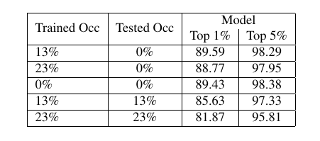

# Now You See Me : Robust Approach to Partial Occlusions
Occlusions of objects is one of the indispensable problems in Computer vision. While Convolutional Neural Networks (CNNs) provide various state of the art approaches for regular image classification, they however, prove to be not as effective for the classification of images with partial occlusions. Partial occlusion is scenario where an object is occluded partially by some other object/space. This problem when solved, holds tremendous potential to facilitate various scenarios. We in particular are interested in autonomous driving scenario and its implications in the same. Autonomous vehicle research is one of the hot topics of this decade, there are ample situations of partial occlusions of a driving sign or a person or other objects at different angles.Considering its prime importance in situations which can be further extended to video analytics of traffic data to handle crimes, anticipate income levels of various groups etc., this holds the potential to be exploited in many ways. In this paper, we introduce our own synthetically created dataset by utilising Stanford Car Dataset and adding occlusions of various sizes and nature to it. On this created dataset, we conducted a comprehensive analysis using various state of the art CNN models such as VGG-19, ResNet 50/101, GoogleNet, DenseNet 121. We further in depth study the effect of varying occlusion proportions and nature on the performance of these models by fine tuning and training these from scratch on dataset and how is it likely to perform when trained in different scenarios, i.e., performance when training with occluded images and unoccluded images, which model is more robust to partial occlusions and so on.

# How to run it?
First clone the repository to local,
```
git clone https://github.com/karthickpgunasekaran/NYSM-RobustPartialOcclusions.git
```
Crop the images in the dataset with respect to Bounding boxes,
```
python Crop_images.py --src "path-to-dataset" --dst "output-folder" --img_height 224 --img_width 224 --entire_csv_dump "path-to-bb"
[usage:]
--src   :  Path to dataset
--dst   :  Path to processed output
--img_height  :   resize image height
--img_width   :   resize image width
--entire_csv_dump   :   bounding box file
```
Next step is to create the datasets by processing them,
```
python CreateArtifacts.py --artifact_type 1 --artifact_size 23 --artifact_color 150 --folder_in "path-to-folder" --folder_out "path-to-folder"  --bb_file "path_to_file"  --image_artifact_images_dir "path-to-folder"  --cropped_image False
[usage:]
--artifact_type  :   0 -random values for different pixels, 1 - contant value for all pixels, 2- contant value choosen randomly, 3 - image artifacts
--artifact_size  :   Proportion of artifact sizes in terms of percentage of entire image size
--artifact_color :   The rgb value of the artifact to be added if its type '2'
--folder_in      :   Path to the original dataset
--folder_out     :   Path to the output folder
--bb_file        :   Bounding box file of the dataset
--cropped_image  :   'True' If the images are cropped according to bb already else 'False'
--image_artifact_images_dir   : path to folder which contains image artifacts for type '3' artifact type
```
Test and training data separation along with evening no of examples per classes,
```
python train_test_split.py  --train_path 'path-to-train-data' --test_path  'path-to-test-data'  --magic_number 10 
[Usage:]
--magic number  : How much deviation from the average is allowed for each classes
--occ_data      : Path to occluded dataset
--unocc_data    : Path to unocc dataset
--train_path    : path to training data
--test_path     : Path to store the test data
```

Run the main file after all the steps, 
```
python nysm.py --num_epochs 5 --batch_size 32  --model_type "vgg19" --optim_type "adam" --learning_rate 1e-3 
[Usage:]
--num_epochs      :   No of epochs
--batch_size_train    :   Training batch size
--class_labels    :   no of classes in dataset
--loader_works    :   multi-process data loading,#loader worker processes.
--artifact        :   occlusion %
--artifact_type   :   artifact type #0,1,2,3
--images_dir      :   Path to train dataset
--images_dir_test :   Path to test data
--store_dir       :   Final output directory
--check_point_path    :   Directory to store the model checkpoints
--plot            :   Directory to store the plots
--USE_GPU         :   To use GPU (True/False)
--learning_rate   :   learning rate for training 
--optim_type      :   optimizer to use (adam/sgd)
--model_type      :   Model to be used (vgg19/resnet50/resnet101/resnet151/googlenet/densenet121/un_vgg19/un_resnet50) 
```
# Data preprocessing
For detailed understanding about the dataset and preprocessing kindly checkout the Project report [here](Report/now_you_see_me_robust_approach_to_partial_occlusions.pdf)

a) Figure Below shows the different occlusion propotions used in the dataset


b) Figure belows demonstrate the different types of artifacts used in the dataset


c) Following figure shows the Dataset statistics


# Results 
For detailed results and analysis please checkout the project report [here](Report/now_you_see_me_robust_approach_to_partial_occlusions.pdf)

a) Table belows shows the effect of training on Lower occlusion data and testing on higher occulusion data.


b) Table below Effect of training on Higher occlusion Datasets and Testing on Lower occlusion Datasets


c) Table below shows Model performance across different Occlusions Sizes


d) Table below shows the Effect of network depth on model performance for different artifacts with 13 % occ


e) Table below Pretrained (PT) vs Not pre-trained(NPT) models for 13% occlusion and artifact type 1


# Contributors 
1. [Karthick Gunasekaran](https://www.linkedin.com/in/karthickpgunasekaran/)
2. [Nikita Jaiman](https://www.linkedin.com/in/nikitajaiman/)
